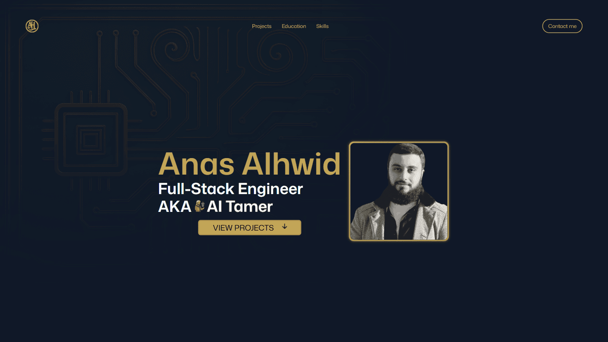

# Full-Stack Engineer Portfolio Website

[](https://anasalhwid.com)
[](https://github.com/AnasAlhwid/portfolio/blob/main/LICENSE)




## 📋 <a name="table">Table of Content</a>

- ✨ [Introduction](#introduction)
- 🧩 [Features](#features)
- 💻 [Tech Stack](#tech-stack)
- 🗂️ [Project Structure](#project-structure)
- ⚙️ [Getting Started](#getting-started)
- 📬 [Contact](#contact)
- 🫰🏻 [Support](#support)
- ⚖️ [License](#license)

## <a name="introduction">✨ Introduction</a>

Welcome to the personal portfolio website of a Full-Stack Engineer. This site is thoughtfully designed to blend elegance with technology, showcasing three key aspects: projects, education, and skills. Built with a modern tech stack and refined UI/UX, it also features immersive 3D elements to enhance the interactive experience.

## <a name="features">🧩 Features</a>

🎨 **Multi-section layout** – Projects, Education, Skills, and Contact.

📱 **Responsive design** – With Tailwind CSS, it is optimized across mobile, tablet, and desktop screens.

🎞️ **Smooth Animations** – Powered by GSAP for scroll interactions.

📽️ **Remarkable 3D** - Powered by Three.JS, an interactive 3D models with realistic lighting and shadows.

📬 **Functional Contact Form** – Integrated with EmailJS.

and many more, including code architecture and reusability.

## <a name="tech-stack">💻 Tech Stack</a>

- [React 19](https://react.dev/)
- JavaScript
- [Vite](https://vite.dev/)
- [Three.js](https://threejs.org/) ([Fiber](https://r3f.docs.pmnd.rs/getting-started/introduction) and [Drei](https://drei.docs.pmnd.rs/getting-started/introduction))
- [GSAP](https://gsap.com/)
- [Tailwind CSS](https://tailwindcss.com/)
- [emailjs](https://www.emailjs.com/)

## <a name="project-structure">🗂️ Project Structure</a>

```
portfolio/
├── public/
|   ├── *images/          # Images
|   └── models/           # 3D Models
|
├── src/
|   ├── components/       # Reusable UI components
|   ├── *constants/       # Static data
|   ├── hooks/            # Custom React hooks
|   ├── sections/         # Website's sections
|   ├── App.jsx           # Root component
|   ├── index.css         # Global styles
|   └── main.jsx          # App entry point
|
├── +.env                 # Environment variables
├── .gitignore            # Git ignored folders/files
├── eslint.config.js      # ESLint config file
├── *index.html           # Project's main HTML file
├── .LICENSE              # Legal license
├── package.json          # Environment required packages
├── README.md             # Project documentation
└── vite.config.js        # Vite config file
```
>### 📝 Notes: 
>- Folders/Files prefixed with `*` has the content that needs to be changed to match your needs.
>- Folders/Files prefixed with `+` needs to be created.

## <a name="getting-started">⚙️ Getting Started</a>

> Follow these steps to set up the project locally on your machine.

### 📃 Prerequisites

- [Git](https://git-scm.com/)
- [Node.js](https://nodejs.org/en)
- [npm](https://www.npmjs.com/)

### 🛠️ Installation & Development

#### *Installation*

```powershell
# Clone the repository
git clone https://github.com/AnasAlhwid/portfolio.git

cd portfolio    # Navigate to the directory

npm install     # Install dependencies
```

#### *Set Up Environment Variables*

Create a new file named `.env` in the root of your project and add the following content:
```env
VITE_APP_EMAILJS_SERVICE_ID=
VITE_APP_EMAILJS_TEMPLATE_ID=
VITE_APP_EMAILJS_PUBLIC_KEY=
```
Replace the placeholder values with your actual [EmailJS](https://www.emailjs.com/) credentials.

#### *Development*

```powershell
npm run dev     # Start development server
```
Open [http://localhost:5173](http://localhost:5173/) in your browser to view the project.

### 🧹 Code Quality

```powershell
npm run lint       # Lints the code with ESLint
```

### 🏗️ Production Build

```powershell
npm run build      # Builds the project

npm run preview    # Serves the production build locally
```

## <a name="contact">📬 Contact</a> 

- 📧 [alhwidanas@gmail.com](mailto:alhwidanas@gmail.com)
- 💼 [LinkedIn](https://www.linkedin.com/in/AnasAlhwid/)
- 💻 [GitHub](https://github.com/AnasAlhwid)

## <a name="support">🫰🏻 Support</a>

<a href="https://www.buymeacoffee.com/AnasAlhwid" target="_blank"></a>

## <a name="license">⚖️ License</a>

[**GNU Affero General Public License v3.0**](https://github.com/AnasAlhwid/ah-portfolio/blob/main/LICENSE)
